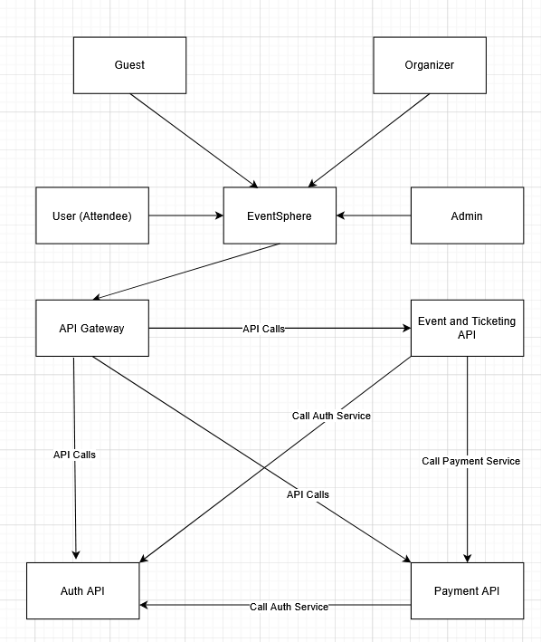
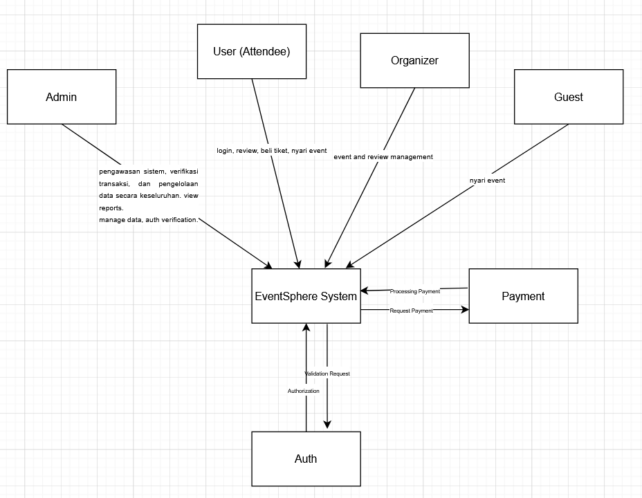
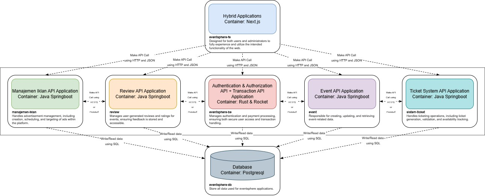
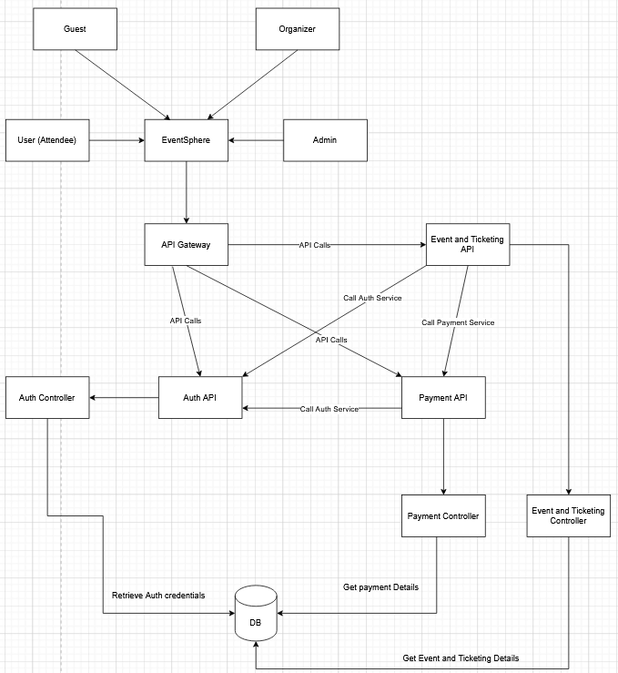

This is a [Next.js](https://nextjs.org) project bootstrapped with [`create-next-app`](https://nextjs.org/docs/app/api-reference/cli/create-next-app).

## Getting Started

First, run the development server:

```bash
npm run dev
# or
yarn dev
# or
pnpm dev
# or
bun dev
```

Open [http://localhost:3000](http://localhost:3000) with your browser to see the result.

You can start editing the page by modifying `app/page.tsx`. The page auto-updates as you edit the file.

This project uses [`next/font`](https://nextjs.org/docs/app/building-your-application/optimizing/fonts) to automatically optimize and load [Geist](https://vercel.com/font), a new font family for Vercel.

## Learn More

To learn more about Next.js, take a look at the following resources:

- [Next.js Documentation](https://nextjs.org/docs) - learn about Next.js features and API.
- [Learn Next.js](https://nextjs.org/learn) - an interactive Next.js tutorial.

You can check out [the Next.js GitHub repository](https://github.com/vercel/next.js) - your feedback and contributions are welcome!

## Deploy on Vercel

The easiest way to deploy your Next.js app is to use the [Vercel Platform](https://vercel.com/new?utm_medium=default-template&filter=next.js&utm_source=create-next-app&utm_campaign=create-next-app-readme) from the creators of Next.js.

Check out our [Next.js deployment documentation](https://nextjs.org/docs/app/building-your-application/deploying) for more details.

# MODULE 9

### Container Diagram


### Context Diagram


### Deployment Diagram


### Future Architecture



### Risk Analysis
 1.  Context-level risks
    - auth level bypass
    - data privacy breach
    - single point of failure on api gateway
    - payment gateway failure
    - unauthorised api calls

2.  container-level risks
    - single database dependency
    - auth service overload
    - slow and inconsisten data retrievals

3.  deployment-level risks
    - database single point of failure
    - microservice communication failures
    - uneven load distribution
    - deployment downtime and complexity

Mitigation strategies:

1. Implement high availability and concurrency for high uptime components by deploying the database in a clustered configuration, implement concurrency techniques for the API Gateway & Auth services, and configure proper load balancing across all services

2. Enhance Security Measures by implement comprehensive API authentication and authorization, put encryption measures on sensitive data both in transit and at rest, do regular security audits and penetration testing and implement proper rate limiting and DDoS protection

3. Improve System Observability by implementing centralized logging and monitoring, create or use external software to check system health, and implement distributed tracing across services

4. Standardize Development Practices by creating consistent error handling patterns across services, standardizing API contracts and documentation, implement comprehensive integration testing, and ensure proper version management for APIs

5. Implement Disaster Recovery by doing regular database backups with tested restoration procedures, document disaster recovery procedures, conduct regular disaster recovery drills and implement proper data retention policies -->